# AI Proxy Architecture Diagrams

This document contains visual diagrams for the AI Proxy System architecture.

---

## System Overview

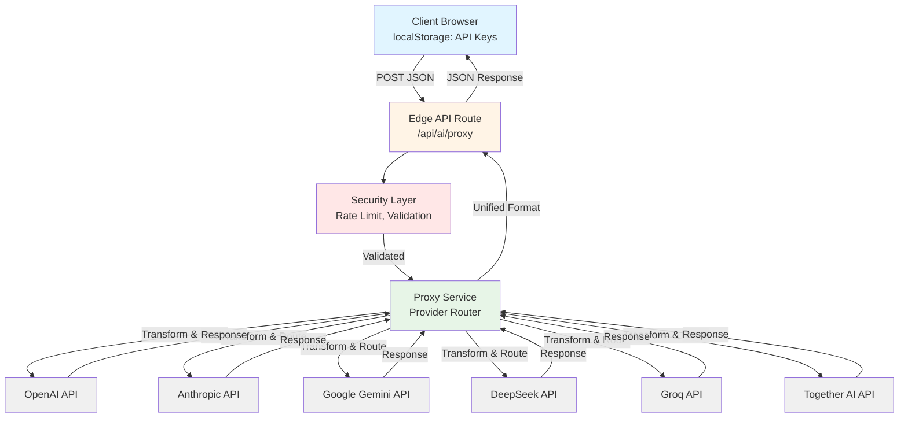

---

## Request Flow

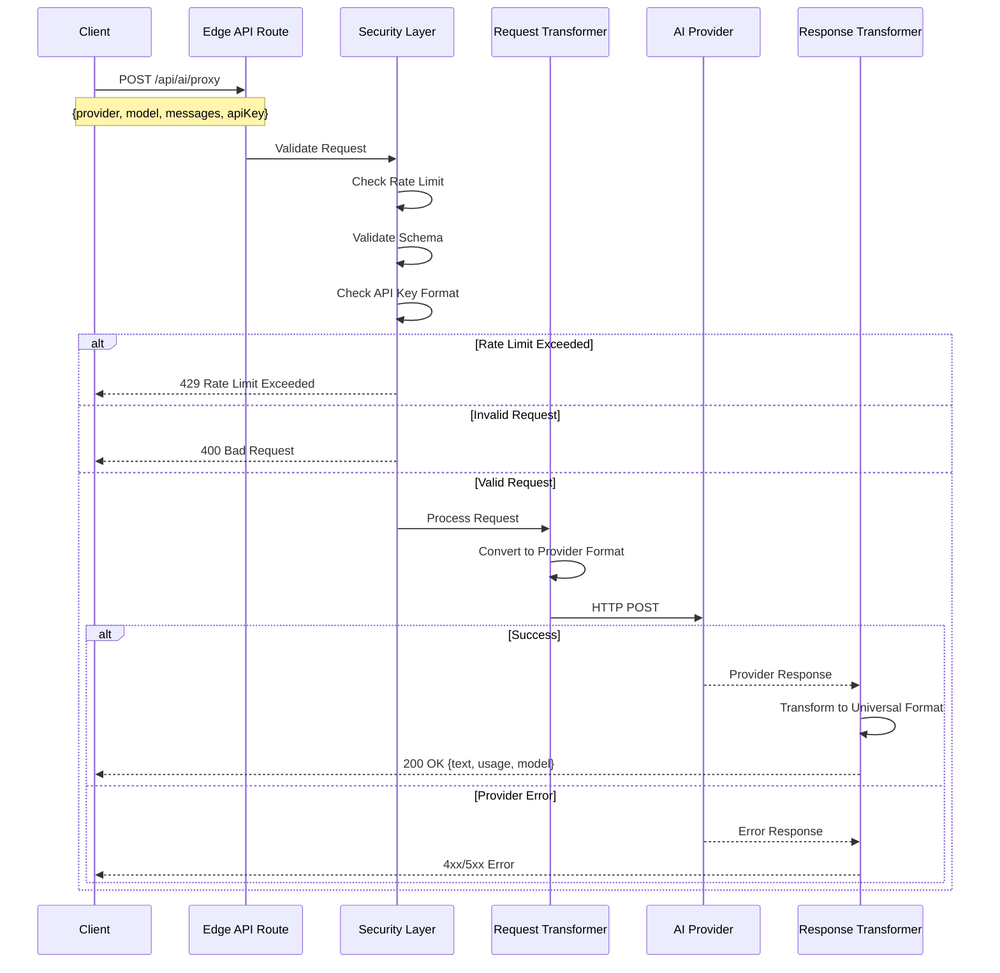

---

## Provider Routing Logic

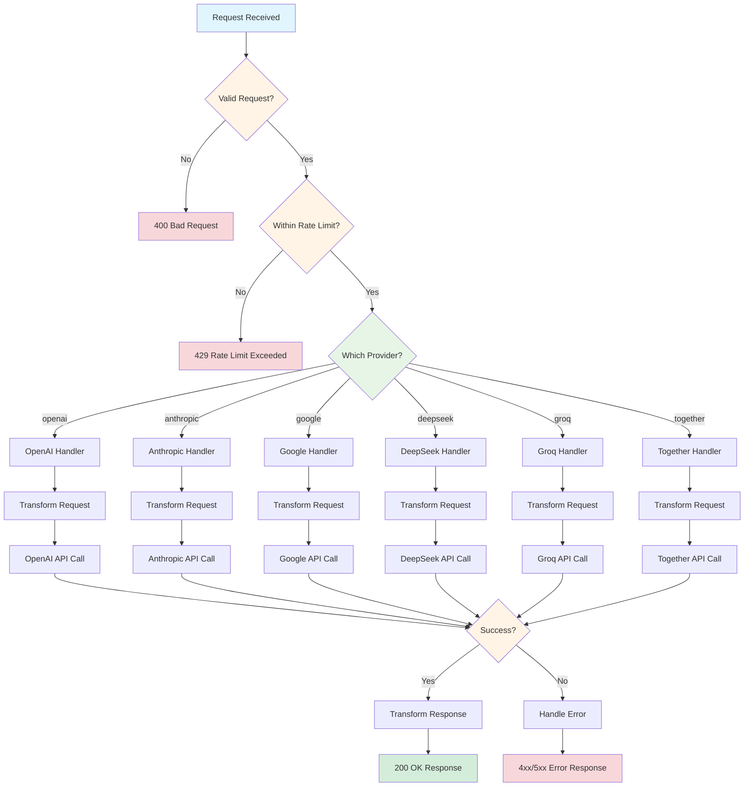

---

## Security Architecture

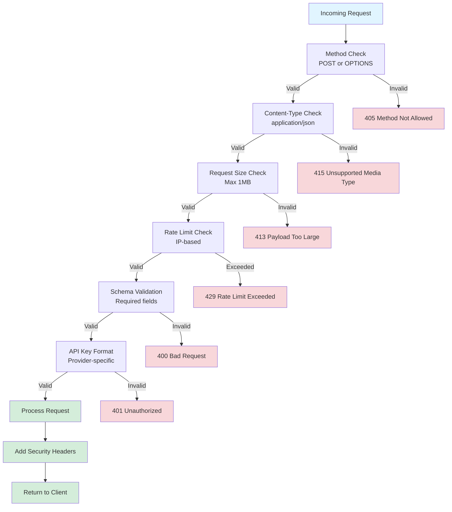

---

## Rate Limiting Flow

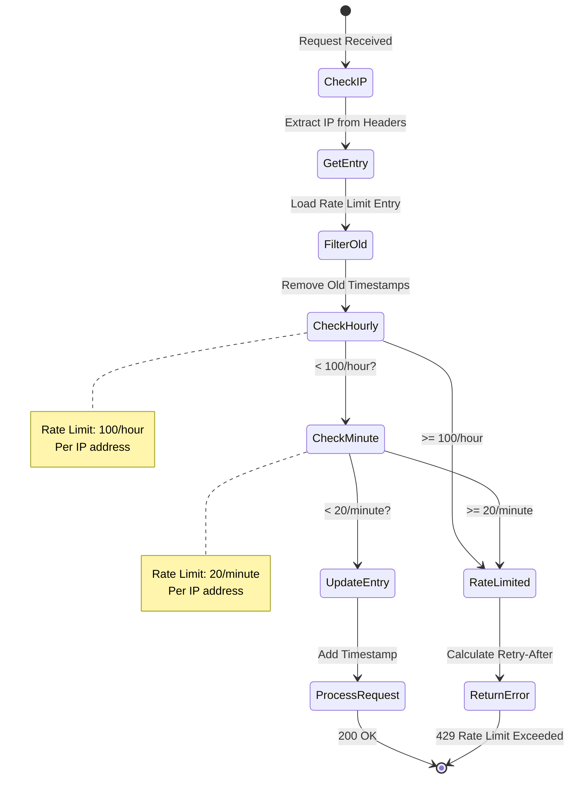

---

## Error Handling Flow

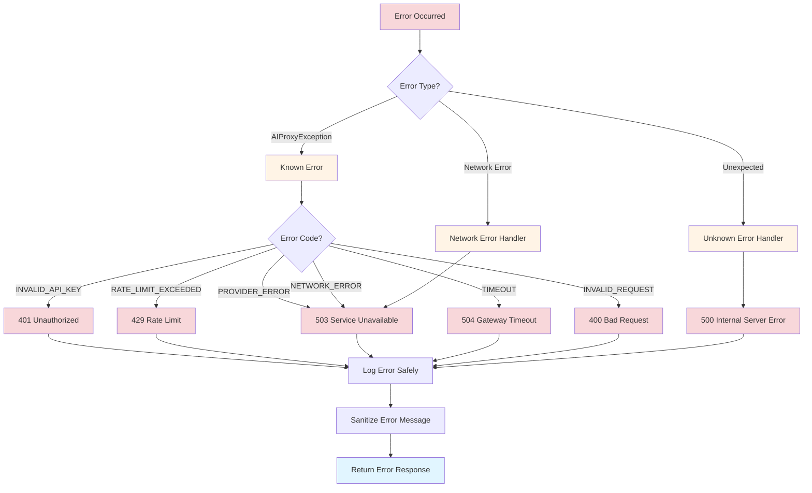

---

## Request Transformation

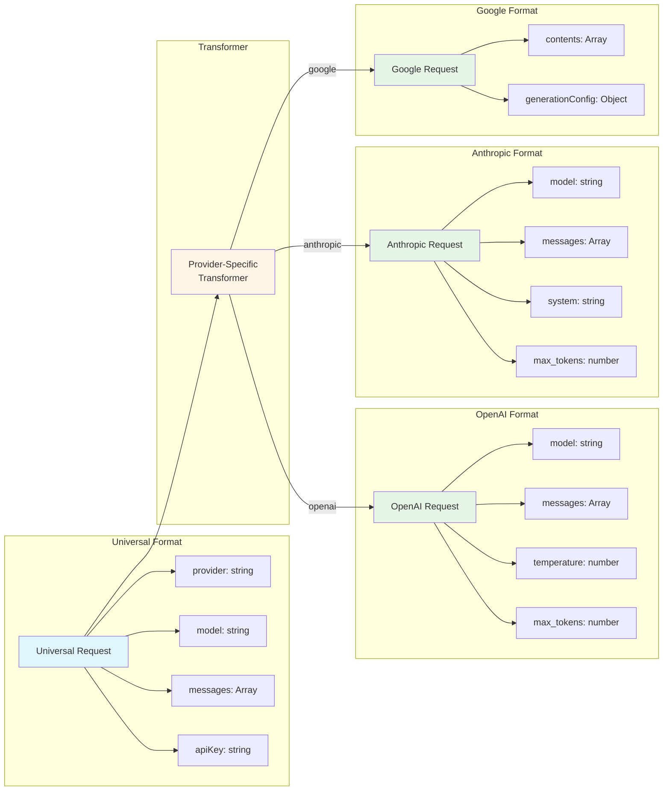

---

## Response Transformation

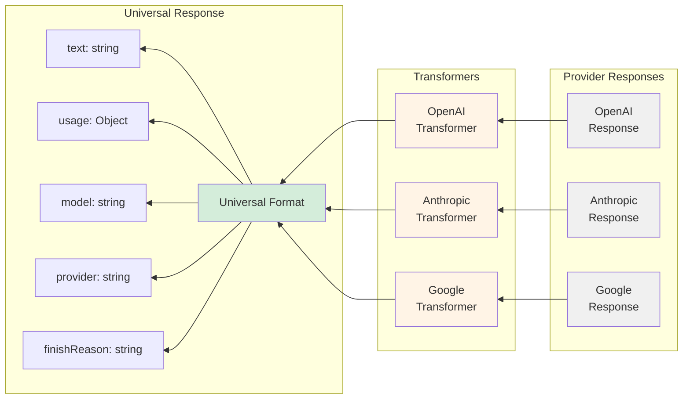

---

## Streaming Architecture (Future)

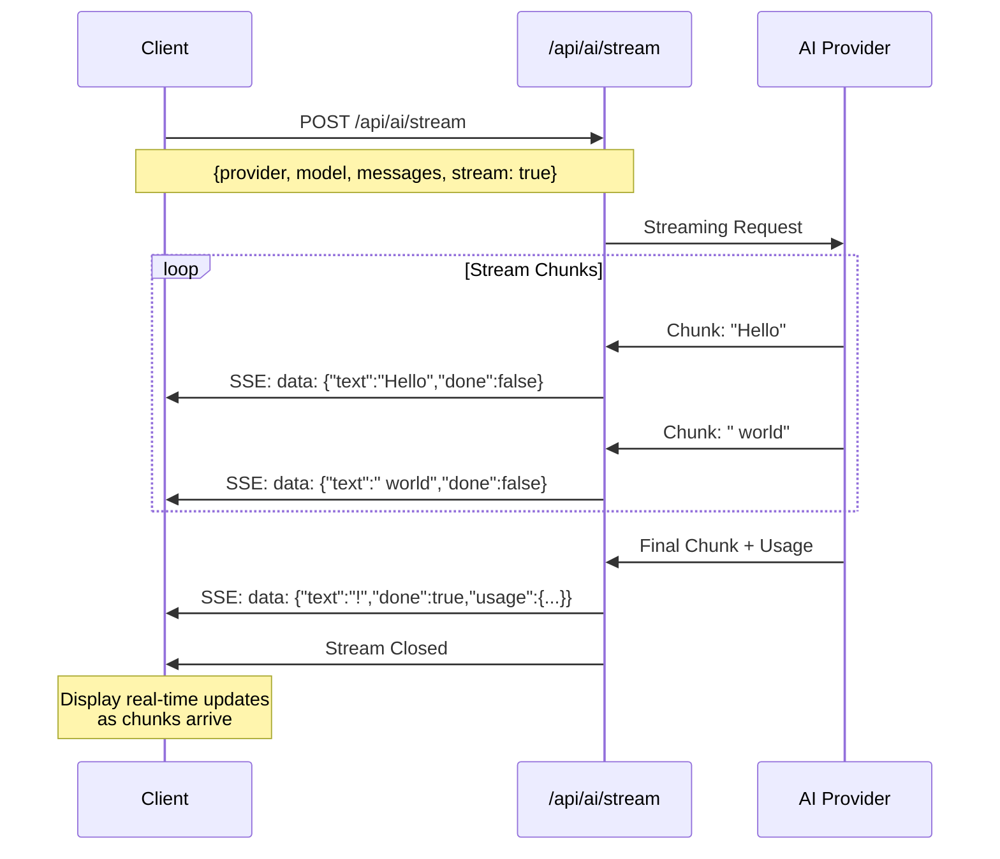

---

## File Organization

```mermaid
graph TB
    subgraph API Routes
        R1[/api/ai/proxy/route.ts]
        R2[/api/ai/stream/route.ts]
        R3[/api/ai/validate/route.ts]
    end

    subgraph Core Libraries
        L1[types.ts<br/>TypeScript Interfaces]
        L2[provider-config.ts<br/>Provider Settings]
        L3[transformers.ts<br/>Request/Response Transform]
        L4[proxy-service.ts<br/>Core Routing Logic]
        L5[error-handler.ts<br/>Error Management]
        L6[rate-limiter.ts<br/>Security & Rate Limiting]
    end

    subgraph Existing
        E1[universal-ai.ts<br/>Server-side AI]
    end

    R1 --> L4
    R2 --> L4
    R3 --> L2

    L4 --> L2
    L4 --> L3
    L4 --> L5

    R1 --> L5
    R2 --> L5
    R3 --> L5

    R1 --> L6
    R2 --> L6
    R3 --> L6

    L3 --> L1
    L2 --> L1
    L4 --> L1
    L5 --> L1

    style R1 fill:#fff4e6
    style R2 fill:#fff4e6
    style R3 fill:#fff4e6
    style L1 fill:#e7f5e7
    style L2 fill:#e7f5e7
    style L3 fill:#e7f5e7
    style L4 fill:#e7f5e7
    style L5 fill:#e7f5e7
    style L6 fill:#e7f5e7
    style E1 fill:#f0f0f0
```

---

## Component Interaction

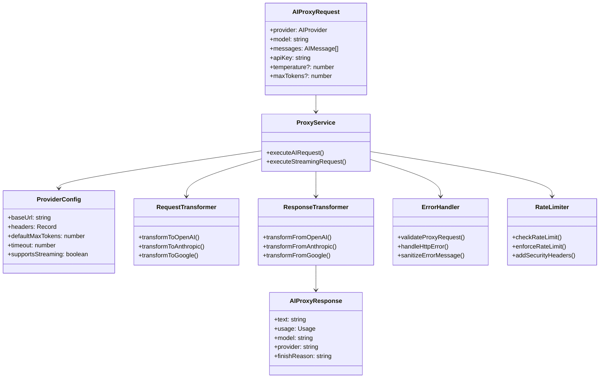

---

## Deployment Architecture

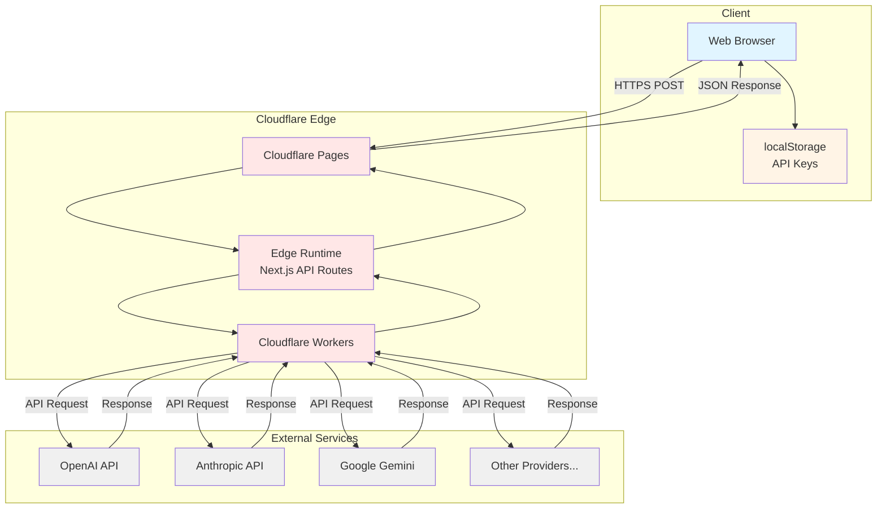

---

## Integration Points

```mermaid
graph LR
    subgraph Client Application
        UI[React UI Components]
        Hook[useAI Hook]
        Storage[localStorage Manager]
    end

    subgraph AI Proxy System
        Proxy[/api/ai/proxy]
        Stream[/api/ai/stream]
        Validate[/api/ai/validate]
    end

    subgraph Existing Features
        PRD[PRD Generation<br/>universal-ai.ts]
        Tasks[Task Generation]
        Onboarding[Onboarding Flow]
    end

    UI --> Hook
    Hook --> Storage
    Hook --> Proxy
    Hook --> Stream
    Hook --> Validate

    Onboarding --> PRD
    PRD --> Tasks

    Note1[Can migrate to use<br/>AI Proxy if needed]
    PRD -.-> Note1
    Tasks -.-> Note1

    style UI fill:#e1f5ff
    style Hook fill:#e1f5ff
    style Storage fill:#fff4e6
    style Proxy fill:#e7f5e7
    style Stream fill:#e7f5e7
    style Validate fill:#e7f5e7
    style PRD fill:#f0f0f0
    style Tasks fill:#f0f0f0
    style Onboarding fill:#f0f0f0
```

---

## Notes

All diagrams are in Mermaid format and can be rendered using:
- GitHub Markdown
- Mermaid Live Editor (https://mermaid.live)
- VS Code with Mermaid extension
- Documentation tools supporting Mermaid

To view these diagrams:
1. Copy the Mermaid code block
2. Paste into https://mermaid.live
3. Click "Render" to see the visual diagram
