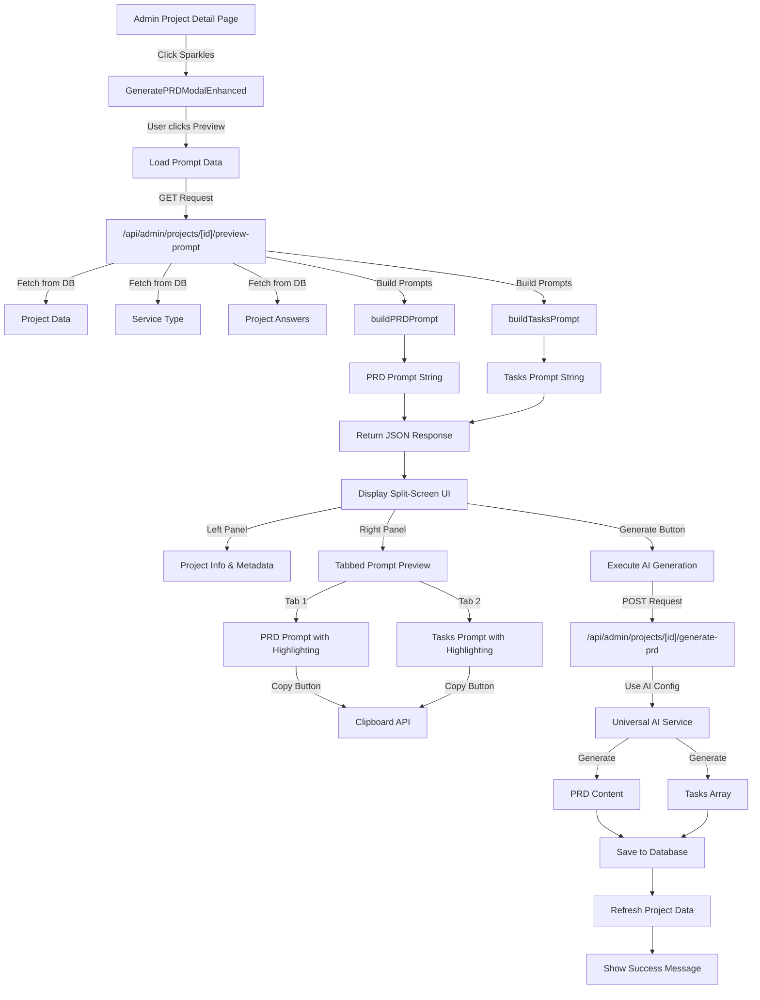
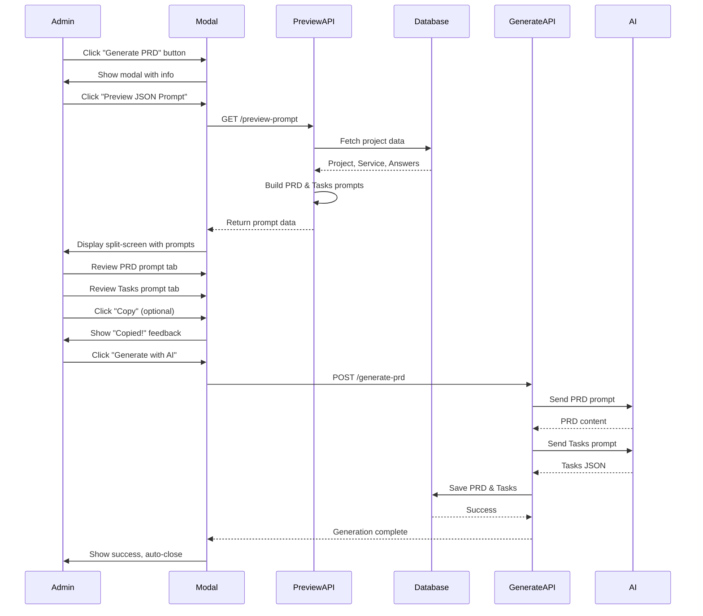
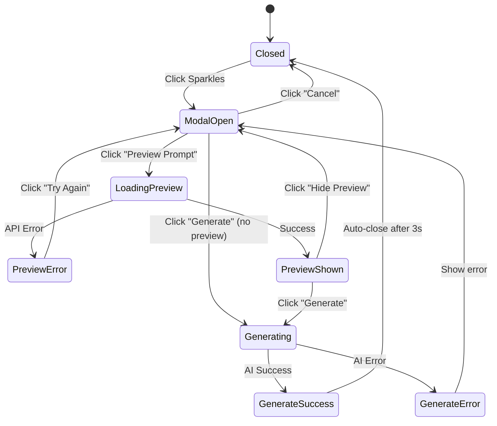
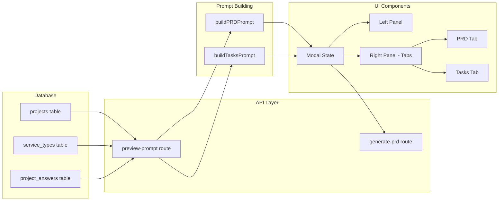
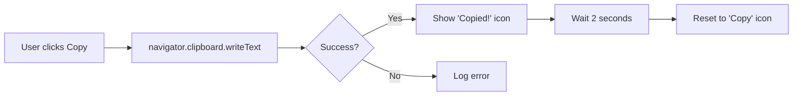

# PRD Prompt Preview Feature - Visual Diagram

## Component Architecture



## User Flow Diagram



## UI State Machine



## Data Flow



## Split-Screen Layout

```
┌────────────────────────────────────────────────────────────────────────┐
│  🌟 Generate PRD & Tasks with AI           [👁️ Preview JSON Prompt]    │
│  Project Name                                                          │
├──────────────────────────────┬─────────────────────────────────────────┤
│                              │                                         │
│  LEFT PANEL (40%)            │  RIGHT PANEL (60%)                      │
│  ─────────────────           │  ──────────────────                     │
│                              │                                         │
│  This will use AI to:        │  ┌─────────────────────────────────┐   │
│  • Comprehensive PRD         │  │  Prompt Preview   🔍            │   │
│  • 15-25 detailed tasks      │  ├─────────────────────────────────┤   │
│  • Time estimates            │  │  [PRD Prompt] [Tasks Prompt]    │   │
│  • Priorities                │  │                          [Copy] │   │
│  • Dependencies              │  ├─────────────────────────────────┤   │
│                              │  │                                 │   │
│  📊 Project Details:         │  │ Create a comprehensive...       │   │
│  ┌─────────────────────┐    │  │                                 │   │
│  │ Service: Landing    │    │  │ Service Type: ${serviceName}    │   │
│  │ Description: 450ch  │    │  │ Project Description: ${desc}    │   │
│  │ Requirements: 8     │    │  │                                 │   │
│  │ Est. Tokens: ~1.2K  │    │  │ Client Requirements:            │   │
│  └─────────────────────┘    │  │ - target_audience: ...          │   │
│                              │  │ - key_features: ...             │   │
│  ⚠️ Replaces existing PRD    │  │                                 │   │
│  ⏱️ Expected: 20-40 seconds  │  │ Generate a detailed PRD with:   │   │
│                              │  │                                 │   │
│                              │  │ # Project Requirements Doc...   │   │
│                              │  │                                 │   │
│                              │  │ ## 1. Executive Summary         │   │
│                              │  │ Brief overview of project...    │   │
│                              │  │                                 │   │
│                              │  │ ## 2. Project Overview          │   │
│                              │  │ Detailed description...         │   │
│                              │  │                                 │   │
│                              │  │ [... scrollable content ...]    │   │
│                              │  │                                 │   │
│                              │  └─────────────────────────────────┘   │
│                              │                                         │
├──────────────────────────────┴─────────────────────────────────────────┤
│                          [Cancel]  [✨ Generate with AI]               │
└────────────────────────────────────────────────────────────────────────┘
```

## Syntax Highlighting Legend

```typescript
// Color-coded text highlighting:

Blue Bold:    # Headers     → Headings in the prompt
Green:        - Bullets     → List items and features
Purple Italic: ${variables} → Dynamic placeholders
Gray:         Normal text   → Regular prompt content
```

## Copy Functionality Flow



## Modal Dialog Size States

```
Normal Mode (no preview):
┌─────────────────────────┐
│  Max Width: 600px       │
│  Height: Auto           │
│  Single Column          │
└─────────────────────────┘

Preview Mode:
┌───────────────────────────────────────────────────────────┐
│  Max Width: 95vw (viewport width)                        │
│  Max Height: 90vh (viewport height)                      │
│  Two Columns: 40% / 60% split                            │
│  Scrollable right panel for long prompts                 │
└───────────────────────────────────────────────────────────┘
```

## Responsive Breakpoints

```
Mobile (<640px):
- Single column layout
- Tabs stack vertically
- Preview shows below info

Tablet (640px - 1024px):
- Split screen maintained
- Narrower gap between panels
- Smaller font sizes

Desktop (>1024px):
- Full split screen
- Comfortable reading width
- Larger prompt preview area
```

## API Response Structure

```json
{
  "success": true,
  "data": {
    "prd": {
      "provider": "Will use default AI provider from settings",
      "model": "Will use configured model",
      "prompt": "Create a comprehensive Project Requirements Document...",
      "metadata": {
        "serviceName": "Landing Page Design",
        "descriptionLength": 450,
        "requirementsCount": 8,
        "estimatedTokens": 1200
      }
    },
    "tasks": {
      "provider": "Will use default AI provider from settings",
      "model": "Will use configured model",
      "prompt": "Based on this PRD, generate 15-25 specific tasks...",
      "metadata": {
        "prdAvailable": true,
        "prdLength": 3500,
        "estimatedTokens": 2800
      }
    },
    "project": {
      "id": 1,
      "name": "Acme Corp Landing Page",
      "service": "Landing Page Design",
      "description": "We need a modern landing page...",
      "questionAnswers": {
        "target_audience": "B2B SaaS companies",
        "key_features": ["Hero section", "Pricing table"],
        "preferred_style": "Minimalist"
      }
    }
  }
}
```

## Feature Integration Points

```
lunaxcode-saas/
├── src/
│   ├── app/
│   │   ├── (admin)/
│   │   │   └── admin/
│   │   │       └── projects/
│   │   │           └── [id]/
│   │   │               └── page.tsx  ← Uses enhanced modal
│   │   └── api/
│   │       └── admin/
│   │           └── projects/
│   │               └── [id]/
│   │                   ├── preview-prompt/
│   │                   │   └── route.ts  ← NEW: Preview API
│   │                   └── generate-prd/
│   │                       └── route.ts  ← Existing: Generation API
│   ├── components/
│   │   └── admin/
│   │       ├── GeneratePRDModal.tsx  ← Original (preserved)
│   │       └── GeneratePRDModalEnhanced.tsx  ← NEW: With preview
│   └── lib/
│       └── ai/
│           └── universal-ai.ts  ← Prompt building logic
```
