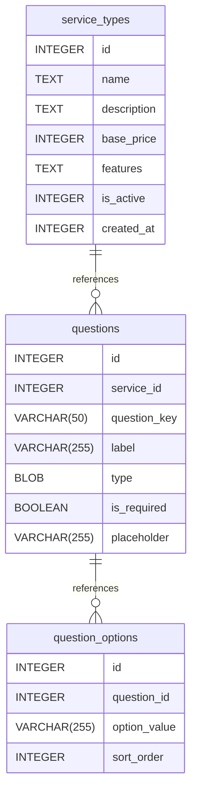

# Lunaxcode DB documentation
## Summary

- [Introduction](#introduction)
- [Database Type](#database-type)
- [Table Structure](#table-structure)
	- [service_types](#service_types)
	- [questions](#questions)
	- [question_options](#question_options)
- [Relationships](#relationships)
- [Database Diagram](#database-diagram)

## Introduction

## Database type

- **Database system:** SQLite
## Table structure

### service_types

| Name        | Type          | Settings                      | References                    | Note                           |
|-------------|---------------|-------------------------------|-------------------------------|--------------------------------|
| **id** | INTEGER | 🔑 PK, null, unique, autoincrement | fk_service_types_id_questions | |
| **name** | TEXT | not null |  | |
| **description** | TEXT | null |  | |
| **base_price** | INTEGER | not null |  | |
| **features** | TEXT | null |  | |
| **is_active** | INTEGER | null, default: 1 |  | |
| **created_at** | INTEGER | not null |  | | 

### questions

| Name        | Type          | Settings                      | References                    | Note                           |
|-------------|---------------|-------------------------------|-------------------------------|--------------------------------|
| **id** | INTEGER | 🔑 PK, null, unique, autoincrement | fk_questions_id_question_options | |
| **service_id** | INTEGER | not null |  | |
| **question_key** | VARCHAR(50) | not null |  | |
| **label** | VARCHAR(255) | not null |  | |
| **type** | BLOB | not null |  | |
| **is_required** | BOOLEAN | not null, default: false |  | |
| **placeholder** | VARCHAR(255) | null |  | | 

### question_options

| Name        | Type          | Settings                      | References                    | Note                           |
|-------------|---------------|-------------------------------|-------------------------------|--------------------------------|
| **id** | INTEGER | 🔑 PK, null, autoincrement |  | |
| **question_id** | INTEGER | not null |  | |
| **option_value** | VARCHAR(255) | not null |  | |
| **sort_order** | INTEGER | null, default: 0 |  | | 

## Relationships

- **service_types to questions**: one_to_many
- **questions to question_options**: one_to_many

## Database Diagram

