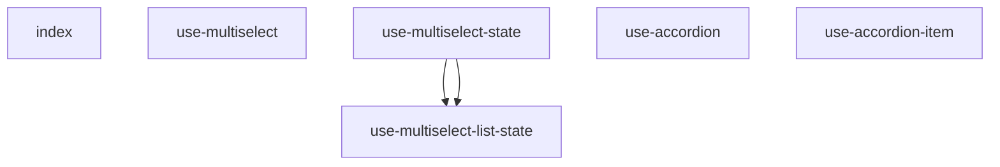

# Component Relationship Graph

## Analysis

- **Total Components**: 671
- **Average Dependencies**: 0.9
- **Most Complex**: use-select

## Insights

Components with many dependencies may benefit from refactoring to reduce coupling.
